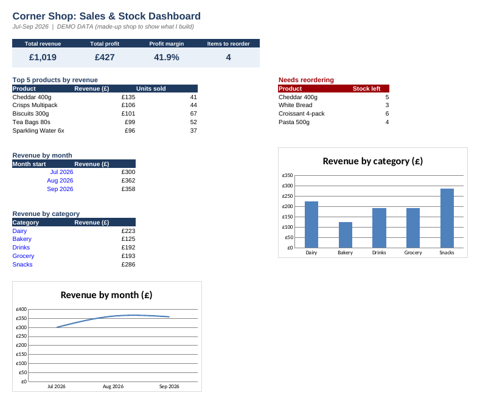
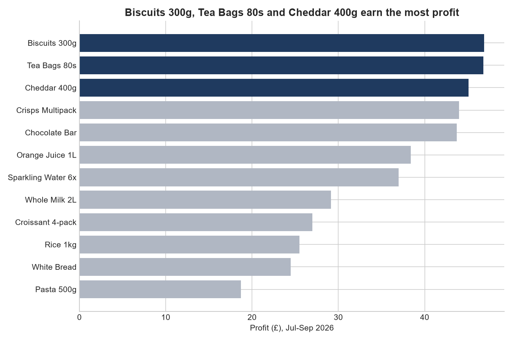

# Corner Shop: Sales & Stock Analysis

> **DEMO DATA.** The shop, products and sales in this project are made up. I built it to show how I turn a small shop's messy stock and sales records into clear answers.



## The problem

A small shop owner usually has sales and stock numbers spread across notebooks and half-finished spreadsheets. They want simple answers:

- What is selling, and what is actually making money?
- Are sales going up or down?
- What do I need to reorder **before** it runs out?

## What I did

I analysed three months of sales (Jul-Sep 2026) for 12 products, using the same data in three tools:

| Tool | What it's for | Where |
|---|---|---|
| **Excel** | Owner-friendly dashboard with formulas that update when new sales are pasted in | `excel/shop_dashboard_demo.xlsx` |
| **SQL** | Five queries answering the owner's questions | `sql/queries.sql` |
| **Python (pandas, matplotlib)** | Same analysis plus charts | `python/analysis.py` |

All three give the same totals, which is how I checked my work.

## What the data shows

- **Revenue £1,019, profit £427, margin 41.9%** over the three months.
- **Snacks** are the biggest category: £286, about 28% of revenue.
- **Cheddar 400g** earns the most revenue (£135) from only 41 units sold. **Chocolate Bar** sells the most units (81) but is cheap, so it doesn't make the top 5 for revenue.
- **August and September revenue was about 19-21% higher than July.**
- **4 products need reordering.** White Bread is the most urgent: 3 left against a reorder level of 12, and it is one of the faster sellers (49 units).
- Profit is spread fairly evenly across the top products (£44-47 each), so no single product carries the shop.



## How to run it

```bash
pip install -r requirements.txt
python python/analysis.py     # prints the results and saves charts to images/
python python/run_sql.py      # runs the SQL queries on the same data
```

## Project structure

```
data/      products.csv, sales.csv
sql/       queries.sql
python/    analysis.py, run_sql.py
images/    charts and dashboard preview
excel/     shop_dashboard_demo.xlsx
```

## Limits

- The data is invented and covers only 3 months, so the patterns here are for illustration, not real findings.
- The stock figures assume the opening stock is correct and there are no returns or waste.
- With real data I would first check for missing or misspelled product names, since a mismatch between the sales and product lists breaks the totals. The script stops with an error if it finds one.

## About me

Munira Momoh, data analyst based in Lagos, Nigeria. Skills: Excel (Power Query, Pivot Tables), Power BI, SQL, Python.
https://www.linkedin.com/in/momohmunira
